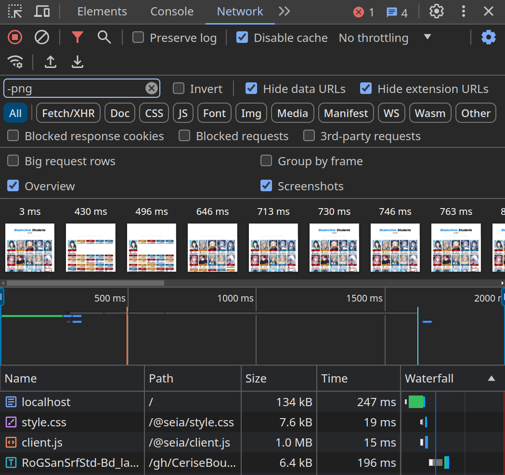

# Seia Demo App

This is a simple student record app that fetches data from the [Blue Archive API](https://api-blue-archive.vercel.app) and showcases some of the key features of Seia.

## Build

This project depends on Seia as a workspace package. To build the project, you need to build the dependencies together.

```sh
$ git clone https://github.com/abiriadev/seia
$ cd seia
$ corepack enable
$ pnpm install
$ pnpm build
$ cd examples/blue-archive-students
$ pnpm turbo build
```

After building the project, you can run the SSR server with the following command:

```sh
$ pnpm start
```

## Key Points

### React Server Components

First, you'll notice that the app fetches data using [undici](https://github.com/nodejs/undici), which relies on the Node.js native API. This is because Seia treats this as a React Server Component, allowing the component to use Node.js APIs.

[`App.tsx`](./src/App.tsx)

```js
// simplified for brevity
import { request } from 'undici'

// ...

export default async () => {
	const students = await request()

	// ...

	return (
		// ...
		<Students students={students} />
		// ...
	)
}
```

You will also notice that the component is an async function, enabling it to await the fetch request.

### Minimal Client Bundle



Open your browser's developer tools, navigate to the network tab, and filter for assets like images. You'll see that the client bundle is very minimal, containing only the necessary code to hydrate the server-rendered content:

-   `index.html`: Contains RSC and SSR rendered HTML, along with embedded RSC payload for hydration.
-   `style.css`: Bundled CSS file, which in this case is compiled with Tailwind CSS.
-   `client.js`: Includes `react`, `react-dom`, `seia.js/runtime`, and your client components' code, all bundled into a single file, which is almost only 1MB, as shown in the screenshot above.

### Client-side Hydration


RSC is not the same concept as SSG!

You can still have full interactivity on the client-side with data fetched on the server, allowing you to have the best of both worlds. As seen in the screenshot above, the search functionality is fully interactive, and the client DOM updates in real-time.
